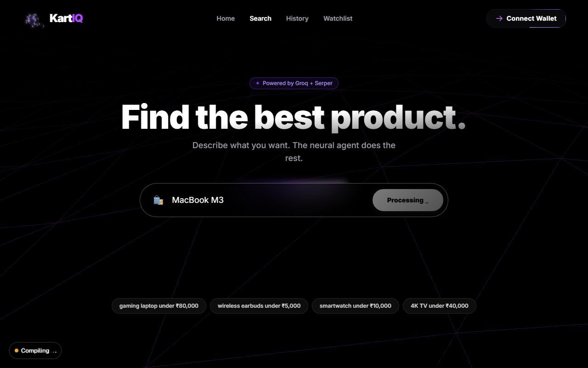
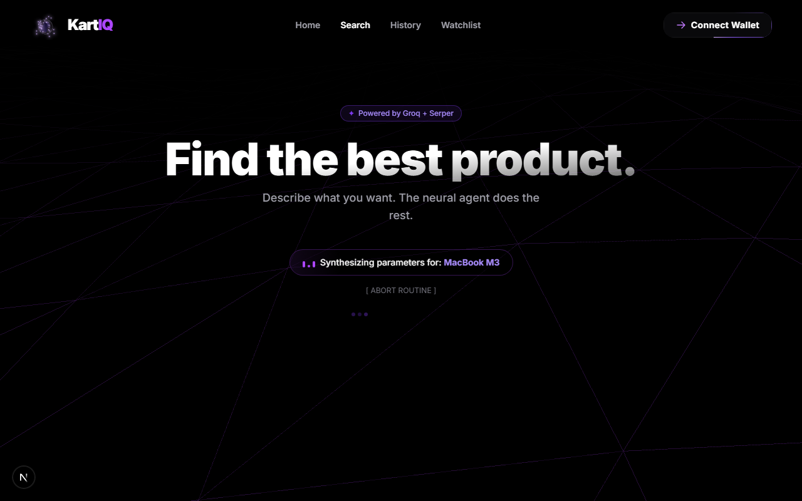
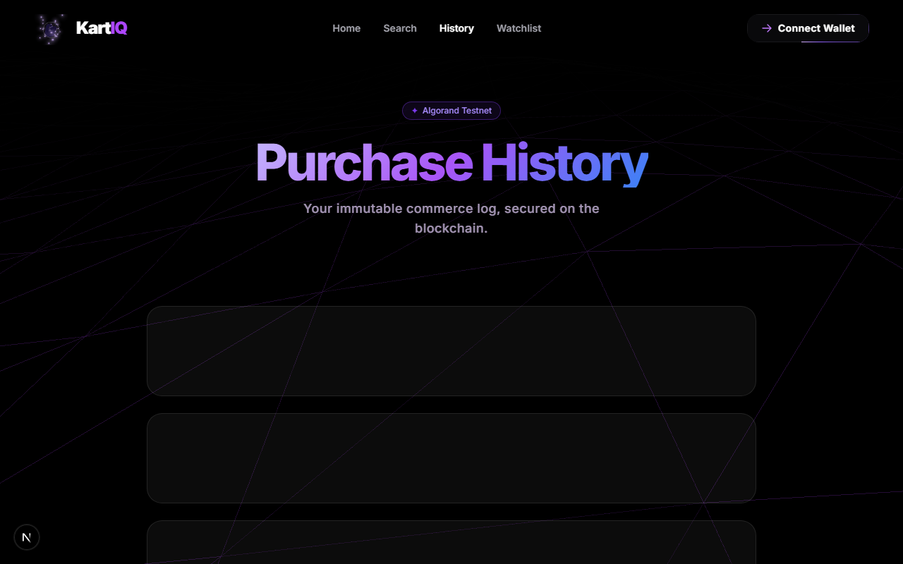
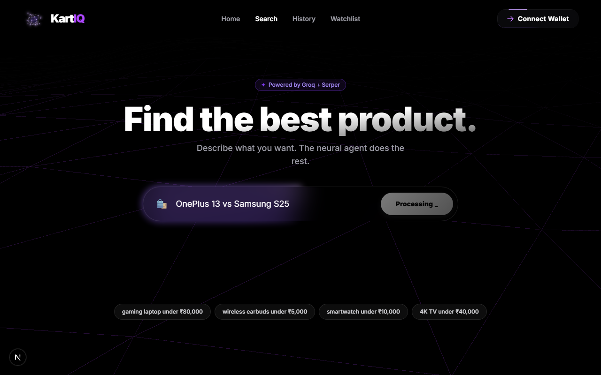

# KartIQ — Autonomous Commerce Agent

> Natural language → live Indian e-commerce search → deterministic
> scoring → AI recommendation → Algorand-signed purchase intent →
> x402 agentic payment. One pipeline, streamed in real time.

## 🛒 What Is This

KartIQ takes a natural-language query and runs a full three-stage pipeline: a 3-tier search agent that pulls live Indian e-commerce data and never returns empty, a deterministic min-max scoring engine that produces reproducible rankings without LLM involvement, and a Groq LLM that explains — but cannot fabricate — those rankings. Results stream to the browser in real time via Server-Sent Events as each agent completes.

Every confirmed purchase creates two verifiable records on Algorand testnet: a PaymentTxn with a structured JSON note (purchase intent log) and a PyTeal smart-contract escrow that holds funds until the buyer confirms delivery. An Algorand Standard Asset is minted as an NFT receipt encoding the product title, INR price, and transaction ID. None of this is simulated — the transactions are on-chain.

KartIQ also implements the x402 agentic payment protocol — the HTTP 402 "Payment Required" status code, now activated for machine use. A gated endpoint returns a PAYMENT-REQUIRED header; the frontend decodes it, builds a USDC transfer (ASA 10458941) via algosdk v3, signs it through Pera Wallet, and the GoPlausible facilitator settles it on-chain. Any AI agent can pay for a KartIQ search session using USDC without an account, OAuth, or human intervention.

## 🔍 Try These Queries

| Query | What it demonstrates |
|---|---|
| `MacBook M3` | Specific model search — direct product links, scoring, AI reasoning |
| `OnePlus 13 vs Samsung S25` | VS Battle Mode — dual parallel search, head-to-head report |
| `wireless earbuds under ₹1,500` | Budget negotiation — surfaces nearest option with "Worth the stretch?" nudge |

## 📸 Screenshots


*Search results — score bar, verdict badge, holographic winner card, AI reasoning panel*


*x402 USDC payment — PAYMENT-REQUIRED header decoded, Pera Wallet signing, settlement tx ID*


*Post-purchase — transaction link, smart contract escrow, NFT proof of purchase, Confirm Delivery / Cancel & Refund*


*VS Battle Mode — OnePlus 13 vs Samsung S25, head-to-head scoring report*

## ✨ Feature Highlights

### Search & AI
| Feature | Detail |
|---|---|
| 3-tier fallback | Serper.dev Google Shopping → Groq compound web search → curated mock data. Never returns empty. |
| Query enrichment | Category noun injection, India buy-intent suffix, Apple-specific rewriting (e.g. "MacBook M3" → "Apple MacBook Air M3 price in India buy online") |
| Affix exclusion | Deterministic regex: "OnePlus 12" never returns "OnePlus 12R" or "OnePlus 12 Pro". Safety net returns unfiltered list if filter would produce zero results. |
| Filters | Cross-category contamination, accessory filter, price sanity per category with brand-specific floors |
| Budget negotiation | If nothing found under budget, surfaces nearest above-budget option with overage % and "Worth the stretch?" nudge |
| Link quality | ASIN extraction for direct Amazon /dp/ links. All links validated https:// before rendering. |
| Quality gate | Zero-signal products dropped only when rated results ≥ 60% of total |
| Cache | In-process LRU, 500 entries, 1-hour TTL |
| Supplemental pass | site:amazon.in + site:flipkart.com operators when major retailers underrepresented (skipped for Apple queries) |
| Battle mode | VS queries run dual parallel searches, pin best-matching product per side via Jaccard similarity, generate head-to-head report |

### Scoring Engine
| Feature | Detail |
|---|---|
| Weights | Price 0.45× (inverted), rating 0.35× (confidence-adjusted), reviews 0.20× (log-normalized) |
| Confidence adjustment | Products with < 30 reviews are penalized |
| Store trust tiers | Official Store 1.12×, Trusted Retailer 1.06×, Unverified 0.88× |
| Price anomaly detection | Listings > 40% below category median flagged "Suspicious Listing" |
| User preference boosts | Preferred brand 1.08×, preferred source 1.04×; avoided brands and max price are hard eliminations |
| Deal verdicts | Excellent Deal / Good Value / Fair Price / Overpriced mapped to score ranges with colour coding |
| Badges | Best Value, Most Reviewed, Top Rated, Budget Pick, Premium Pick, Low Confidence, Penalized Rating |

### Blockchain & Payments
| Feature | Detail |
|---|---|
| Phase 4 | PaymentTxn with structured JSON note: product title, INR price, query, receipt number |
| Phase 5 | PyTeal escrow LogicSig — validates note != "", amount > 0, receiver == ALGORAND_RECEIVER |
| Escrow actions | Buyer can Confirm Delivery or Cancel & Refund from the product card or history page |
| NFT receipt | ASA minted per confirmed purchase encoding product metadata and tx ID |
| x402 gate | HTTP 402 on GET /api/v1/x402/initiate. USDC ASA 10458941 (Algorand testnet). GoPlausible facilitator. |
| Wallet | Pera Wallet via @perawallet/connect + WalletConnect v2. 4100-error guard with 3s reconnect-retry. |
| Explorer | All links point to lora.algokit.io and testnet.explorer.perawallet.app |

### Frontend & UX
| Feature | Detail |
|---|---|
| Streaming | SSE with per-agent status events, 30s timeout guard, esRef race-condition prevention |
| Product cards | 3D tilt (react-parallax-tilt), holographic foil on winner, score bar, verdict badge, AI reasoning panel |
| Skeleton loaders | 3 placeholder cards during loading, min-h-[280px] prevents layout shift |
| Battle Arena | Animated VS layout for comparison queries |
| Social proof | Reddit + YouTube sentiment via Serper. Live/mock flag shown in UI. |
| Performance | Three.js code-split (ssr: false), route prefetch on search CTA hover |
| Other | Custom cursor, share page with score arc, price watchlist with APScheduler 24h checks |

## 🏗️ System Architecture

```text
User Query (natural language)
│
▼
Next.js 16 Frontend
┌─────────────────────────────────────────────┐
│  EventSource → SSE stream                   │
│  ProductCard (3D tilt, holographic winner)  │
│  Battle Arena (VS mode)                     │
│  Pera Wallet (WalletConnect v2)             │
└────────────────┬────────────────────────────┘
│  GET /api/search/stream
▼
FastAPI + Uvicorn (Python 3.11)
┌──────────────────────────────────────────────────────┐
│  AgentState — only shared data bus between agents    │
│  Agents never call each other directly               │
│                                                      │
│  ┌─────────────────┐                                 │
│  │  search_agent   │  Serper → Groq → mock           │
│  │                 │  Enrich · Filter · Dedupe        │
│  └────────┬────────┘                                 │
│           │ search_results[]                         │
│  ┌────────▼────────┐                                 │
│  │  compare_agent  │  Min-max · Trust · Anomaly       │
│  └────────┬────────┘                                 │
│           │ scored_products[]                        │
│  ┌────────▼────────┐                                 │
│  │  decision_agent │  Groq LLM — explain, not invent │
│  └────────┬────────┘                                 │
└───────────┼──────────────────────────────────────────┘
│  SSE: status → products → recommendation
▼
POST /api/confirm/submit → Algorand Testnet
┌──────────────────────────────────────────────────────┐
│  Phase 4: PaymentTxn + JSON note                     │
│  Phase 5: PyTeal LogicSig escrow                     │
│  NFT receipt: ASA minted with product metadata       │
│  Confirm Delivery / Cancel & Refund via escrow calls │
└──────────────────────────────────────────────────────┘
│
▼
GET /api/v1/x402/initiate → x402 Payment Gate
┌──────────────────────────────────────────────────────┐
│  HTTP 402 + base64 PAYMENT-REQUIRED header           │
│  Frontend builds USDC axfer (ASA 10458941)           │
│  GoPlausible facilitator verifies on-chain           │
│  PAYMENT-RESPONSE header → tx ID shown in UI        │
└──────────────────────────────────────────────────────┘

→  data flow          [ ]  processing layer
All agent communication is through AgentState only.
Agents never call each other directly.
```

## 🔗 Live Blockchain Proof

Every confirmed purchase creates three verifiable records on Algorand testnet. Here are two real purchases made during development.

### MacBook Air M4 — ₹1,03,800 · 18 May 2026

| Record | Link |
|---|---|
| Purchase Transaction | [YTLY76TE7QQ5DISV3QFN6FN4LYQZBPR4FIWQWYPFYXZMTXPHOTYQ ↗](https://testnet.explorer.perawallet.app/tx/YTLY76TE7QQ5DISV3QFN6FN4LYQZBPR4FIWQWYPFYXZMTXPHOTYQ/) |
| Smart Contract Escrow | [Application 762738486 ↗](https://testnet.explorer.perawallet.app/application/762738486/) |
| NFT Proof of Purchase | [ASA 762738543 ↗](https://testnet.explorer.perawallet.app/asset/762738543/) |

### Redmi Watch 5 Active — ₹1,999 · 17 May 2026

| Record | Link |
|---|---|
| Purchase Transaction | [JDXBKOBWVNELYCRSPMXP4A65AJ2OOAN5AY6J4DTVJIBKSD5C7VOQ ↗](https://testnet.explorer.perawallet.app/tx/JDXBKOBWVNELYCRSPMXP4A65AJ2OOAN5AY6J4DTVJIBKSD5C7VOQ/) |
| Smart Contract Escrow | [Application 762674841 ↗](https://testnet.explorer.perawallet.app/application/762674841/) |
| NFT Proof of Purchase | [ASA 762674850 ↗](https://testnet.explorer.perawallet.app/asset/762674850/) |

Each purchase creates a PaymentTxn note, a PyTeal escrow contract, and an NFT receipt ASA — all verifiable on the Algorand testnet explorer without any account.

## ⚡ x402 Agentic Payments

x402 activates the HTTP 402 status code for machine-to-machine payments. When an AI agent hits GET /api/v1/x402/initiate, the server responds with 402 and a base64-encoded PAYMENT-REQUIRED header describing the USDC amount and recipient. The agent decodes this, constructs an ASA 10458941 transfer using algosdk v3, and signs it via Pera Wallet. The GoPlausible facilitator verifies the ed25519 signature and settles on-chain. The 200 response then carries the settlement tx ID in a PAYMENT-RESPONSE header.

This matters because it removes every human-facing authentication primitive from the payment flow. No API key registration. No OAuth callback. No stored card. An agent discovers what payment is required from the HTTP response itself, pays with USDC, and gets the resource. KartIQ is both sides of this: a resource server that sells search results, and a consumer that can pay for them autonomously.

## 🛠️ Tech Stack

| Layer | Technologies |
|---|---|
| Backend | Python 3.11, FastAPI, Uvicorn, Pydantic v2, asyncio, slowapi, APScheduler |
| AI / LLM | Groq API — llama-3.3-70b-versatile, fallback llama3-8b-8192 |
| Search | Serper.dev Google Shopping API |
| Blockchain | Algorand Testnet, py-algorand-sdk, PyTeal, AlgoNode RPC |
| Payments | x402 protocol, USDC ASA 10458941, GoPlausible facilitator |
| Frontend | Next.js 16, React 19, TypeScript, Tailwind CSS v4, Framer Motion 12, Three.js, algosdk v3 |
| Wallet | Pera Wallet via @perawallet/connect + WalletConnect v2 |

## 🚀 Getting Started

> **Minimum to run (no blockchain):** Set `SERPER_API_KEY` and `GROQ_API_KEY` only. Everything else is optional.
> **Fully offline:** Set `MOCK_ONLY=true` — no API keys needed at all.

### Prerequisites

- Python 3.11+
- Node.js 18+
- Serper.dev API key (free, no credit card)
- Groq API key (free)
- Algorand testnet account (blockchain features only)
- WalletConnect Cloud project ID (prevents Pera Wallet QR errors)

### Installation

```bash
git clone https://github.com/murthyroshan/autonomous-commerce-agent.git
cd autonomous-commerce-agent

python -m venv venv
venv\Scripts\activate        # Windows
# source venv/bin/activate   # macOS / Linux
pip install -r requirements.txt

cd frontend && npm install && cd ..
```

### Environment Variables

```env
# Required: core search and AI
SERPER_API_KEY=your_serper_api_key_here
GROQ_API_KEY=your_groq_api_key_here

# Required: Algorand blockchain (Phase 4+)
ALGORAND_MNEMONIC=word1 word2 ... word25
ALGORAND_RECEIVER=your_algorand_testnet_address

# x402 payments
KARTIQ_MERCHANT_WALLET=your_algorand_testnet_address
FACILITATOR_URL=https://facilitator.goplausible.xyz
ALGORAND_NETWORK=testnet

# Frontend
NEXT_PUBLIC_API_URL=http://localhost:8000
NEXT_PUBLIC_WALLETCONNECT_PROJECT_ID=your_walletconnect_project_id

# Optional
MOCK_ONLY=false
API_SECRET_KEY=your_secret_here
FRONTEND_ORIGIN=http://localhost:3000
THREAD_POOL_SIZE=20
PREWARM_QUERIES=gaming laptop under 80000,best phone under 30000
```

### Run

```bash
# Terminal 1 — backend
uvicorn api.main:app --reload --port 8000

# Terminal 2 — frontend
cd frontend && npm run dev
# → http://localhost:3000
```

## 📡 API Reference

Protected endpoints require X-API-Key header. Rate limits: search 15/min, confirm 10/min, all others 30/min.

| Method | Path | Description |
|---|---|---|
| GET | /api/health | Liveness check. No auth required. |
| GET | /api/search/stream | SSE stream. Query param: q=. Emits status, product, recommendation events. |
| POST | /api/search | Synchronous search. Body: {"query": string}. |
| POST | /api/confirm | Phase 4 PaymentTxn purchase intent log. |
| POST | /api/confirm/prepare | Build unsigned PyTeal escrow transaction for client-side signing. |
| POST | /api/confirm/submit | Submit signed transaction. Deploys escrow, mints NFT receipt. |
| GET | /api/v1/x402/initiate | x402 payment gate. Returns 402 + PAYMENT-REQUIRED header. |
| POST | /api/escrow/confirm_delivery | Release escrow funds to merchant after delivery confirmed. |
| POST | /api/escrow/refund | Refund escrowed funds to buyer. |
| POST | /api/watchlist | Add product to 24h price-alert watchlist. |
| GET | /api/history | Purchase history for session user. |

## 🛡️ Security

- **API key**: X-API-Key header only. Compared with hmac.compare_digest — no timing oracle.
- **CORS**: localhost origins only added when NODE_ENV != "production"
- **Rate limiting**: slowapi on every endpoint
- **Mnemonic protection**: ALGORAND_MNEMONIC scrubbed from all exception traces before logging
- **Transaction validation**: receiver address validated in both route handler and submit_signed_transaction() before any network call
- **Path traversal**: _safe_user_id() on every file path. user_id hardcoded server-side ("demo"), never from user input.
- **URI allowlist**: WatchlistAddRequest.link rejects javascript: and data: URIs
- **Response hardening**: SearchResponse uses ConfigDict(extra="ignore"). All HTTPException details return "Internal server error".
- **SSE timeout**: asyncio.wait_for 30s ceiling with clean error event on expiry

## Project Structure

```text
autonomous-commerce-agent/
├── agents/
│   ├── state.py            # AgentState TypedDict — only shared data bus
│   ├── search_agent.py     # 3-tier search, enrichment, filtering, LRU cache
│   ├── compare_agent.py    # Min-max scoring, trust tiers, anomaly detection
│   ├── decision_agent.py   # Groq LLM justification, battle mode
│   ├── pipeline.py         # Wires agents — agents never call each other
│   ├── memory.py           # Preferences, purchase history (JSONL)
│   ├── watchlist.py        # APScheduler 24h price-alert job
│   ├── social_proof.py     # Reddit + YouTube sentiment
│   └── mock_data.py        # Curated fallback products
├── api/
│   ├── main.py             # FastAPI app, lifespan, CORS, rate limiter
│   ├── routes.py           # All endpoints, SSE stream, x402 gate
│   └── models.py           # Pydantic schemas
├── blockchain/
│   ├── algorand.py         # PaymentTxn, escrow, NFT mint, tx submit
│   └── contract.py         # PyTeal LogicSig escrow contract
├── frontend/
│   └── src/
│       ├── app/            # Next.js App Router pages
│       ├── components/     # ProductCard, BattleArena, NavbarLogo…
│       └── hooks/          # usePeraWallet, useAgentStream…
├── .env.example
└── requirements.txt
```

## License

MIT
