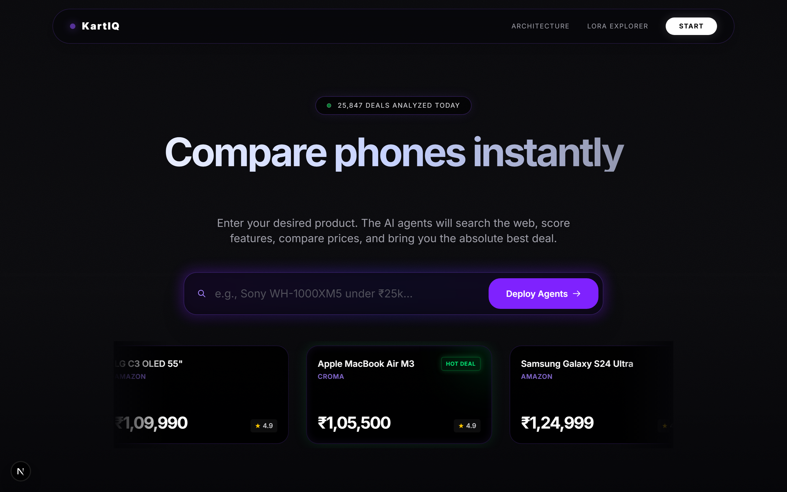
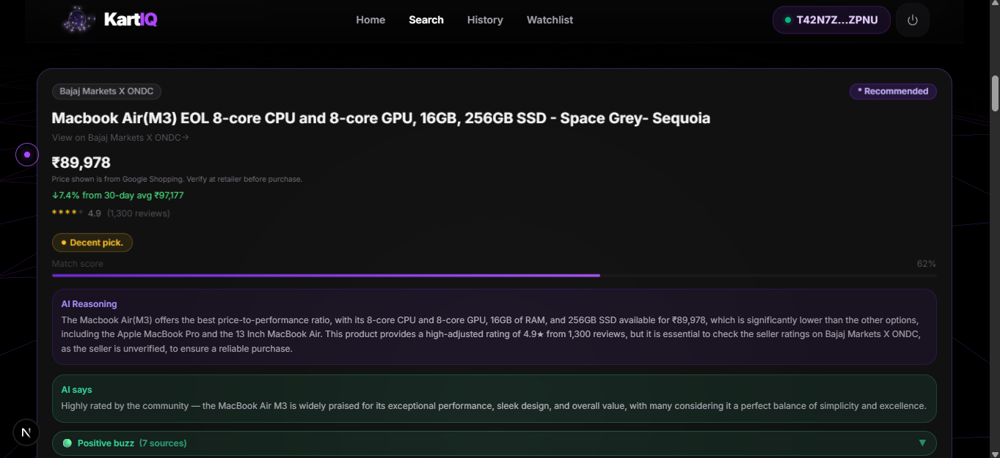
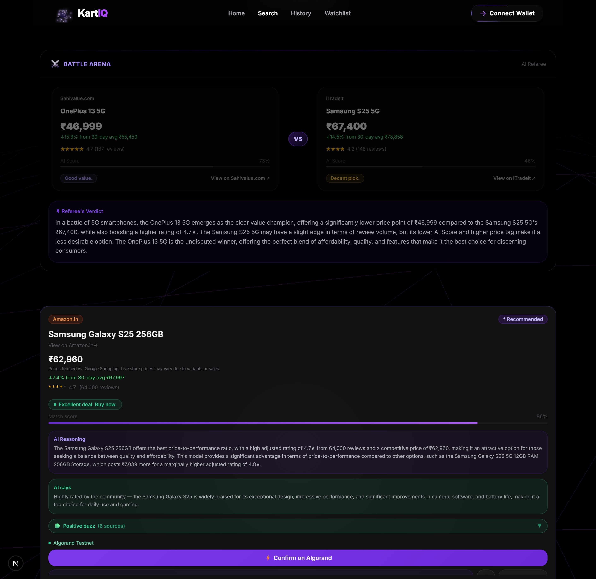
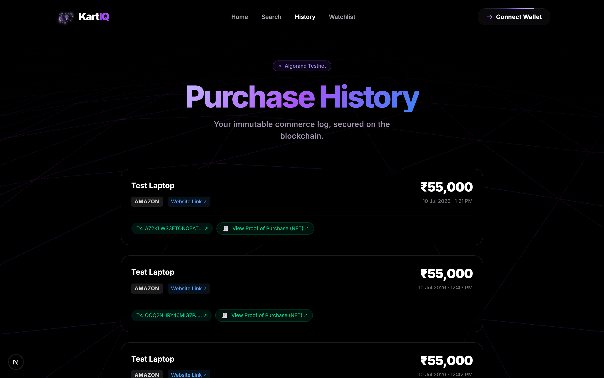

<div align="center">

# 🛒 KartIQ

### Autonomous Commerce Agent

**Type what you want in plain English. An agent searches live Indian e-commerce, scores every option deterministically, explains its pick, and settles the purchase on-chain — streamed to your browser in real time.**

[](https://www.python.org/)
[](https://fastapi.tiangolo.com/)
[](https://nextjs.org/)
[](https://developer.algorand.org/)
[](tests/)
[](LICENSE)

[Try it](#-try-it) · [Features](#-features) · [Architecture](#-architecture) · [Quick start](#-quick-start) · [On-chain proof](#-on-chain-proof) · [API](#-api-reference)

</div>

<br/>



---

## Overview

KartIQ turns a natural-language query into a full, auditable shopping decision through a three-stage agent pipeline:

1. **Search** — a 3-tier fallback agent (Serper Google Shopping → Groq web search → curated mock data) that pulls live Indian retail listings and *never returns empty*.
2. **Compare** — a pure, deterministic min-max scoring engine (no LLM) that produces reproducible rankings with trust tiers, anomaly detection, and confidence-adjusted ratings.
3. **Decide** — a Groq LLM that **explains** the ranking in plain English but **cannot fabricate** it — the numbers come from the scoring engine, not the model.

Every step streams to the browser over **Server-Sent Events**. Confirmed purchases are recorded on **Algorand testnet** as a payment note, a PyTeal escrow contract, and an NFT receipt — all verifiable on-chain. KartIQ also implements **x402**, the HTTP 402 "Payment Required" protocol, so an AI agent can pay for a search session in USDC with no account, key, or human in the loop.

> **The core principle:** the AI *narrates* the decision — it never *makes* it. Rankings are deterministic and reproducible; the LLM only justifies them.

---

## 🔍 Try It

With both servers running, open **http://localhost:3000** and try:

| Query | What it shows |
|---|---|
| `gaming laptop under 80000` | Budget parsing, category detection, scoring, AI reasoning, social proof |
| `OnePlus 13 vs Samsung S25` | **Battle Mode** — dual parallel search, unified re-scoring, head-to-head referee verdict |
| `wireless earbuds under ₹1,500` | **Budget negotiation** — surfaces the nearest option with a "Worth the stretch?" nudge |
| `MacBook M3` | Apple-aware query rewriting, direct product links, radar-chart breakdown |

---

## 📸 Screenshots

<table>
<tr>
<td width="50%"><br/><sub><b>Winner card</b> — match score, deal verdict, AI reasoning, community buzz</sub></td>
<td width="50%"><br/><sub><b>Battle Mode</b> — head-to-head scoring with an AI referee verdict</sub></td>
</tr>
<tr>
<td colspan="2"><br/><sub><b>On-chain history</b> — every purchase logged to Algorand testnet with transaction + NFT receipt links</sub></td>
</tr>
</table>

---

## ✨ Features

### Search & AI
- **3-tier fallback** — Serper → Groq → mock; the pipeline never returns an empty state.
- **Query enrichment** — category-noun injection, India buy-intent suffix, and Apple-specific rewriting (`MacBook M3` → `Apple MacBook Air M3 price in India`).
- **Precise model matching** — deterministic affix exclusion so `OnePlus 12` never returns `OnePlus 12R` or `12 Pro`, with a safety net that avoids empty results.
- **Smart budget negotiation** — no match under budget? It surfaces the closest option above it with the overage and a nudge.
- **Battle Mode** — `A vs B` queries run two parallel searches, pin the best match per side, re-score on one baseline, and generate a referee verdict.

### Deterministic Scoring
- **Weighted min-max** — price `0.45×` (inverted), rating `0.35×` (confidence-adjusted), reviews `0.20×` (log-normalized).
- **Store trust tiers** — official store `1.12×`, trusted retailer `1.06×`, unverified `0.88×`.
- **Anomaly detection** — listings far below the category median are flagged *Suspicious*.
- **Personalization** — preferred brands/sources boost; avoided brands and max-price are hard eliminations.
- **Verdicts & badges** — *Excellent Deal / Good Value / Decent Pick / Wait for a Sale / Overpriced*, plus Best Value, Most Reviewed, Top Rated, Budget Pick, and more.

### Blockchain & Payments (Algorand testnet)
- **Purchase note** — a `PaymentTxn` carrying structured JSON (title, INR price, score, receipt #).
- **Escrow contract** — a PyTeal smart contract that holds funds until the buyer confirms delivery (or refunds on expiry).
- **NFT receipt** — an ASA minted per purchase encoding product metadata and the purchase tx ID.
- **x402 agentic payments** — a gated endpoint returns `402 + PAYMENT-REQUIRED`; the client builds a USDC transfer (ASA `10458941`), signs via Pera Wallet, and the GoPlausible facilitator settles it on-chain.

### Frontend & UX
- **Real-time streaming** via SSE with per-agent status, a 30s timeout guard, and a non-streaming fallback.
- **Lazy social proof** — Reddit/YouTube sentiment fetched after render so it never blocks the search.
- **Polished UI** — 3D product cards, holographic winner card, radar-chart score breakdown, share pages, and a price watchlist with scheduled checks.

---

## 🏗️ Architecture

`AgentState` is the **only** shared data bus — agents never call each other directly; the pipeline wires them.

```text
Natural-language query
        │
        ▼
┌─────────────────────────────────────────────┐
│  Next.js 16 · React 19                       │
│  EventSource ── SSE ──► live status + result │
└──────────────────────┬──────────────────────┘
                       │  GET /api/search/stream
                       ▼
┌─────────────────────────────────────────────┐
│  FastAPI · Python 3.11        [AgentState]   │
│                                              │
│   search_agent ─► compare_agent ─► decision  │
│   Serper→Groq→mock  min-max/trust   Groq LLM │
│   enrich·filter     anomaly·boosts  explains │
└──────────────────────┬──────────────────────┘
                       │  status → products → recommendation
                       ▼
┌─────────────────────────────────────────────┐
│  Algorand Testnet                            │
│   PaymentTxn note · PyTeal escrow · NFT ASA  │
│   x402 gate: 402 → USDC axfer → settlement   │
└─────────────────────────────────────────────┘
```

---

## 🚀 Quick Start

> **Minimum to run:** just `SERPER_API_KEY` and `GROQ_API_KEY` (both free). Everything else is optional.
> **Fully offline:** set `MOCK_ONLY=true` and no keys are needed at all.

### Prerequisites
- Python 3.11+ and Node.js 18+
- [Serper.dev](https://serper.dev) key (free) · [Groq](https://console.groq.com) key (free)
- *Optional:* Algorand testnet account + WalletConnect project ID (for blockchain features)

### Install

```bash
git clone https://github.com/murthyroshan/autonomous-commerce-agent.git
cd autonomous-commerce-agent

# Backend
python -m venv venv
source venv/bin/activate          # Windows: venv\Scripts\activate
pip install -r requirements.txt

# Frontend
cd frontend && npm install && cd ..
```

### Configure

```bash
cp .env.example .env      # then fill in the keys below
```

```env
# Required — search & AI
SERPER_API_KEY=your_serper_key
GROQ_API_KEY=your_groq_key

# Optional — blockchain (Phase 4+)
ALGORAND_MNEMONIC=word1 word2 ... word25
ALGORAND_RECEIVER=your_testnet_address
KARTIQ_MERCHANT_WALLET=your_testnet_address

# Frontend
NEXT_PUBLIC_API_URL=http://localhost:8000
NEXT_PUBLIC_WALLETCONNECT_PROJECT_ID=your_walletconnect_id

# Optional — offline mode
MOCK_ONLY=false
```

### Run

```bash
# Terminal 1 — backend
uvicorn api.main:app --reload --port 8000

# Terminal 2 — frontend
cd frontend && npm run dev        # → http://localhost:3000
```

### Test

```bash
pytest tests/ -v          # 94 tests
```

---

## 🔗 On-Chain Proof

Every confirmed purchase writes three verifiable records to Algorand testnet — no account needed to inspect them.

**MacBook Air M4 — ₹1,03,800**

| Record | Link |
|---|---|
| Purchase transaction | [`YTLY76TE…OTYQ`](https://testnet.explorer.perawallet.app/tx/YTLY76TE7QQ5DISV3QFN6FN4LYQZBPR4FIWQWYPFYXZMTXPHOTYQ/) |
| Escrow contract | [Application `762738486`](https://testnet.explorer.perawallet.app/application/762738486/) |
| NFT receipt | [ASA `762738543`](https://testnet.explorer.perawallet.app/asset/762738543/) |

**Redmi Watch 5 Active — ₹1,999**

| Record | Link |
|---|---|
| Purchase transaction | [`JDXBKOBW…7VOQ`](https://testnet.explorer.perawallet.app/tx/JDXBKOBWVNELYCRSPMXP4A65AJ2OOAN5AY6J4DTVJIBKSD5C7VOQ/) |
| Escrow contract | [Application `762674841`](https://testnet.explorer.perawallet.app/application/762674841/) |
| NFT receipt | [ASA `762674850`](https://testnet.explorer.perawallet.app/asset/762674850/) |

---

## 🧰 Tech Stack

| Layer | Technologies |
|---|---|
| **Backend** | Python 3.11 · FastAPI · Uvicorn · Pydantic v2 · slowapi · APScheduler |
| **AI / LLM** | Groq — `llama-3.3-70b-versatile` (primary), `llama-3.1-8b-instant` (fallback) |
| **Search** | Serper.dev Google Shopping API |
| **Blockchain** | Algorand testnet · py-algorand-sdk · PyTeal · AlgoNode RPC |
| **Payments** | x402 protocol · USDC (ASA `10458941`) · GoPlausible facilitator |
| **Frontend** | Next.js 16 · React 19 · TypeScript · Tailwind v4 · Framer Motion · Three.js · algosdk v3 |
| **Wallet** | Pera Wallet (`@perawallet/connect`) + WalletConnect v2 |

---

## 📡 API Reference

Rate-limited (search 15/min, confirm 10/min, others 30/min). Protected routes require the `X-API-Key` header when `API_SECRET_KEY` is set.

| Method | Endpoint | Description |
|---|---|---|
| `GET` | `/api/health` | Liveness check (no auth) |
| `GET` | `/api/search/stream` | SSE stream — emits `status`, `result`, `error` events |
| `POST` | `/api/search` | Synchronous search — `{ "query": string }` |
| `POST` | `/api/clarify` | Detects vague queries and returns clarifying questions |
| `POST` | `/api/confirm/submit` | Submit a signed tx; deploys escrow, mints NFT receipt |
| `GET` | `/api/v1/x402/initiate` | x402 payment gate — returns `402 + PAYMENT-REQUIRED` |
| `POST` | `/api/escrow/confirm_delivery` | Release escrow to merchant |
| `POST` | `/api/escrow/refund` | Refund escrow to buyer |
| `GET` | `/api/history` · `/api/watchlist` | Purchase history · price watchlist |

Interactive docs at **http://localhost:8000/docs**.

---

## 🛡️ Security

- **Path traversal** — every file path is passed through `_safe_user_id()`; server locks `user_id` rather than trusting the client.
- **Concurrency** — receipt-counter and preference writes are serialized to prevent lost updates / duplicate receipts.
- **Mnemonic hygiene** — `ALGORAND_MNEMONIC` is validated and never logged in traces.
- **Input hardening** — query sanitization, `javascript:`/`data:` URI rejection on stored links, and generic 500s that never leak internals.
- **Rate limiting & CORS** — slowapi on every route; origins allowlisted via `FRONTEND_ORIGIN`.

---

## 📁 Project Structure

```text
autonomous-commerce-agent/
├── agents/
│   ├── state.py            # AgentState — the only shared data bus
│   ├── search_agent.py     # 3-tier search, enrichment, filtering, cache
│   ├── compare_agent.py    # min-max scoring, trust tiers, anomaly detection
│   ├── decision_agent.py   # Groq justification + battle-mode referee
│   ├── pipeline.py         # wires the agents together
│   ├── memory.py           # preferences + purchase history (JSONL)
│   ├── watchlist.py        # scheduled price alerts
│   └── mock_data.py        # curated offline fallback
├── api/
│   ├── main.py             # app, CORS, rate limiter, lifespan
│   ├── routes.py           # endpoints, SSE stream, x402 gate
│   └── models.py           # Pydantic schemas
├── blockchain/
│   ├── algorand.py         # PaymentTxn, escrow, NFT mint, tx submit
│   └── contract.py         # PyTeal escrow contract
├── frontend/               # Next.js 16 app (App Router)
└── tests/                  # 94 tests
```

---

## 📄 License

Released under the [MIT License](LICENSE).
